# College ERP System - Entity Relationship Diagram

This document contains a professional Entity Relationship (ER) Diagram utilizing **Crow's Foot notation**, meticulously categorized into the core operational modules of the College ERP System. 

It handles Multi-Tenancy (Campuses), Subject-wise academic tracking, and extensive relational metrics.

```mermaid
erDiagram
    %% ==========================================
    %% 1. AUTHENTICATION & MULTI-TENANCY MODULE
    %% ==========================================
    CAMPUSES {
        UUID id PK
        string campus_name
        string campus_code
        string address
    }
    
    USERS {
        UUID id PK
        UUID campus_id FK "CAMPUSES.id"
        string name
        string email
        string password_hash
        enum role "ADMIN / STUDENT / FACULTY"
        timestamp last_login
        string profile_picture_url
    }
    
    AUTH_TOKENS {
        UUID id PK
        UUID user_id FK "USERS.id"
        enum type "REFRESH / PASSWORD_RESET"
        string token
    }

    %% ==========================================
    %% 2. COMMUNICATION MODULE
    %% ==========================================
    ANNOUNCEMENTS {
        UUID id PK
        string title
        text message
        UUID created_by FK "USERS.id"
    }
    
    NOTIFICATIONS {
        UUID id PK
        string title
        text message
        string target_role
    }

    %% ==========================================
    %% 3. ACADEMIC MODULE
    %% ==========================================
    DEPARTMENTS {
        UUID id PK
        UUID campus_id FK "CAMPUSES.id"
        string department_name
        string department_code
    }
    
    SEMESTERS {
        UUID id PK
        int semester_number
        string academic_year
    }
    
    FACULTY {
        UUID id PK
        UUID user_id FK "USERS.id"
        string faculty_code
        UUID department_id FK "DEPARTMENTS.id"
        string designation
        string qualification
        numeric salary
    }
    
    COURSES {
        UUID id PK
        string course_name
        string course_code
        UUID department_id FK "DEPARTMENTS.id"
        string course_type
        int duration_years
    }
    
    SUBJECTS {
        UUID id PK
        string subject_name
        string subject_code
        UUID department_id FK "DEPARTMENTS.id"
        UUID course_id FK "COURSES.id"
        UUID faculty_id FK "FACULTY.id"
        UUID semester_id FK "SEMESTERS.id"
        int credits
        int theory_marks
        int practical_marks
    }
    
    ASSIGNMENTS {
        UUID id PK
        UUID subject_id FK "SUBJECTS.id"
        string title
        date due_date
    }
    
    EXAMS {
        UUID id PK
        UUID subject_id FK "SUBJECTS.id"
        string exam_type
        date exam_date
        int max_marks
    }
    
    TIMETABLE {
        UUID id PK
        UUID subject_id FK "SUBJECTS.id"
        UUID faculty_id FK "FACULTY.id"
        string day
        string room_no
        time start_time
        time end_time
    }

    %% ==========================================
    %% 4. STUDENT MANAGEMENT MODULE
    %% ==========================================
    STUDENTS {
        UUID id PK
        UUID user_id FK "USERS.id"
        string roll_no
        UUID department_id FK "DEPARTMENTS.id"
        UUID semester_id FK "SEMESTERS.id"
        date dob
        string gender
        date admission_date
    }
    
    PARENT_GUARDIAN_DETAILS {
        UUID id PK
        UUID student_id FK "STUDENTS.id"
        string father_name
        string mother_name
        string emergency_contact
    }
    
    ENROLLMENTS {
        UUID id PK
        UUID student_id FK "STUDENTS.id"
        UUID course_id FK "COURSES.id"
    }
    
    SUBJECT_ENROLLMENTS {
        UUID id PK
        UUID student_id FK "STUDENTS.id"
        UUID subject_id FK "SUBJECTS.id"
    }
    
    ATTENDANCE {
        UUID id PK
        UUID student_id FK "STUDENTS.id"
        UUID subject_id FK "SUBJECTS.id"
        date attendance_date
        string status "PRESENT / ABSENT"
    }
    
    ASSIGNMENT_SUBMISSIONS {
        UUID id PK
        UUID student_id FK "STUDENTS.id"
        UUID assignment_id FK "ASSIGNMENTS.id"
        string file_url
        numeric marks_obtained
    }
    
    EXAM_RESULTS {
        UUID id PK
        UUID student_id FK "STUDENTS.id"
        UUID subject_id FK "SUBJECTS.id"
        UUID exam_id FK "EXAMS.id"
        numeric marks_obtained
        string grade
    }

    %% ==========================================
    %% 5. FINANCE & LEAVE MODULES
    %% ==========================================
    FEES {
        UUID id PK
        UUID student_id FK "STUDENTS.id"
        string fee_type
        numeric amount
        string payment_status "PAID / PENDING / PARTIAL"
    }
    
    FEE_TRANSACTIONS {
        UUID id PK
        UUID fee_id FK "FEES.id"
        string transaction_reference
        string payment_method
        numeric amount_paid
        timestamp payment_date
    }
    
    LEAVE_REQUESTS {
        UUID id PK
        UUID student_id FK "STUDENTS.id"
        text reason
        string status "PENDING / APPROVED / REJECTED"
    }

    %% ==========================================
    %% 6. LIBRARY MODULE
    %% ==========================================
    BOOKS {
        UUID id PK
        string title
        string isbn
        int available_copies
    }
    
    BOOK_ISSUE_RECORDS {
        UUID id PK
        UUID student_id FK "STUDENTS.id"
        UUID book_id FK "BOOKS.id"
        date issue_date
        date return_date
    }

    %% ==========================================
    %% RELATIONSHIPS (CROW'S FOOT NOTATION)
    %% ==========================================
    
    %% Multi-Tenancy & Auth
    CAMPUSES ||--o{ USERS : "has (1:N)"
    CAMPUSES ||--o{ DEPARTMENTS : "has (1:N)"
    USERS ||--o{ AUTH_TOKENS : "has (1:N)"
    USERS ||--o| STUDENTS : "1:1 (optional)"
    USERS ||--o| FACULTY : "1:1 (optional)"
    USERS ||--o{ ANNOUNCEMENTS : "creates (1:N)"
    
    %% Academics
    DEPARTMENTS ||--o{ STUDENTS : "has (1:N)"
    DEPARTMENTS ||--o{ FACULTY : "has (1:N)"
    DEPARTMENTS ||--o{ COURSES : "has (1:N)"
    DEPARTMENTS ||--o{ SUBJECTS : "has (1:N)"
    COURSES ||--o{ SUBJECTS : "has (1:N)"
    
    SEMESTERS ||--o{ STUDENTS : "contains (1:N)"
    SEMESTERS ||--o{ SUBJECTS : "offers (1:N)"
    
    FACULTY ||--o{ SUBJECTS : "teaches (1:N)"
    FACULTY ||--o{ TIMETABLE : "assigned to (1:N)"
    
    SUBJECTS ||--o{ ASSIGNMENTS : "has (1:N)"
    SUBJECTS ||--o{ EXAMS : "has (1:N)"
    SUBJECTS ||--o{ TIMETABLE : "has (1:N)"
    
    %% Students & Metrics
    STUDENTS ||--o| PARENT_GUARDIAN_DETAILS : "1:1"
    STUDENTS ||--o{ ENROLLMENTS : "has (1:N)"
    STUDENTS ||--o{ SUBJECT_ENROLLMENTS : "has (1:N)"
    SUBJECTS ||--o{ SUBJECT_ENROLLMENTS : "has (1:N)"
    STUDENTS ||--o{ ATTENDANCE : "has (1:N)"
    SUBJECTS ||--o{ ATTENDANCE : "has (1:N)"
    
    STUDENTS ||--o{ ASSIGNMENT_SUBMISSIONS : "submits (1:N)"
    ASSIGNMENTS ||--o{ ASSIGNMENT_SUBMISSIONS : "has (1:N)"
    
    STUDENTS ||--o{ EXAM_RESULTS : "has (1:N)"
    EXAMS ||--o{ EXAM_RESULTS : "generates (1:N)"
    SUBJECTS ||--o{ EXAM_RESULTS : "generates (1:N)"
    
    %% Finance & Library
    STUDENTS ||--o{ FEES : "has (1:N)"
    FEES ||--o{ FEE_TRANSACTIONS : "has (1:N)"
    STUDENTS ||--o{ LEAVE_REQUESTS : "has (1:N)"
    STUDENTS ||--o{ BOOK_ISSUE_RECORDS : "borrows (1:N)"
    BOOKS ||--o{ BOOK_ISSUE_RECORDS : "issued as (1:N)"
```

